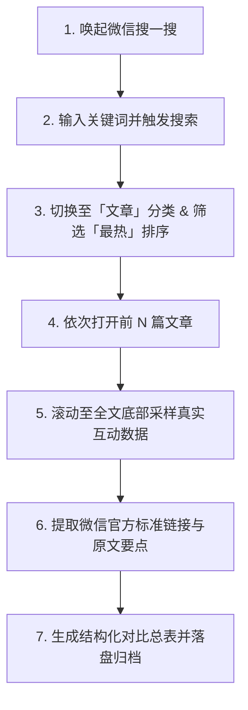

# MP-Hot: 微信搜一搜热门公众号文章分析与归档技能

## 一、概述

本技能用于通过微信桌面端「搜一搜」或微信检索管线，按指定关键词自动化检索公众号文章、筛选「最热」排序、依次深度阅读前 N 篇、滚动至全文底部采集真实互动数据（包含文章底部精确阅读量、点赞数、转发/推荐数、收藏数、评论数等），提取微信官方标准链接（`https://mp.weixin.qq.com/s/...`），并沉淀结构化数据总表与原文核心要点至本地交付文件。

---

## 二、适用场景与触发词

- **触发词**：`搜一搜`、`微信搜一搜`、`微信文章`、`公众号文章`、`公众号热门`、`微信爆款调研`、`mp-hot`
- **典型场景**：
  1. 检索特定行业/景点/事件/人物关键词在微信公众平台的最热文章
  2. 采集前排爆款文章的全维度真实互动数据（阅读量、赞、转发、收藏、留言）
  3. 提取官方永久/标准短链接并归档文章核心内容到本地 Markdown/Excel

---

## 三、标准执行工作流 (Standard Workflow)

### 步骤详解与实操要点

1. **唤起与窗口定位**
   - 微信主窗口与搜一搜 Webview 独立（标题为 `微信 (窗口)`，逻辑尺寸约为 1512x859）。
   - 自动化操作前需通过 `app.performSecondaryAction(0, "Raise")` 置顶并激活。

2. **分类与排序控制**
   - **分类标签**：搜一搜搜索框下方包含「全部」「文章」「百科」「视频」等，点击「文章」分类。
   - **排序筛选**：在分类栏下方点击「最热」（与「最新」「已关注」并列）。

3. **数据采集（关键点）**
   - **阅读量必须拉到底部**：微信文章的精确阅读量（如 10万+、2.5万、1.9万）位于正文最底端（留言区上方），打开文章后需连续触发 `Page_Down` 或滚动到底部才能完整加载并读取。
   - **互动指标采集项**：
     - 点赞数（大拇指图标）
     - 转发/在看/推荐数（分享箭头图标）
     - 收藏数（爱心图标）
     - 评论/留言数（气泡图标）
     - 赞赏/喜欢作者人数
     - 听全文人数

4. **官方链接提取**
   - 优先提取标准微信短链（`https://mp.weixin.qq.com/s/<22位短码>`）或完整带 `__biz`/`mid`/`idx`/`sn` 的官方永久地址。
   - 避免使用搜狗/外部临时重定向地址。

5. **交付与落盘规范**
   - 结果必须在本地创建交付文档（例如 `outputs/<关键词>_微信搜一搜_最热前N篇汇总.md`）。
   - 提供 Markdown 对比表格 + 各篇原文核心要点 + 真实链接。

---

## 四、字段数据字典

| 字段名称 | 类型 | 说明 | 示例 |
| :--- | :--- | :--- | :--- |
| `rank` | 整数 | 搜一搜最热排名（1-N） | 1 |
| `title` | 字符串 | 文章完整标题 | 《此墓一年只开放3天，马上又到开放日了》 |
| `account` | 字符串 | 发布公众号名称 | 探古笔记 |
| `author` | 字符串 | 文章作者/编辑 | 探古木木 |
| `publish_date` | 字符串 | 发布日期或相对时间 | 2025-04-15 |
| `read_count` | 字符串 | 底部实测阅读量 | 10万+ / 2.5万 |
| `like_count` | 整数 | 点赞数 | 366 |
| `share_count` | 整数 | 转发/推荐数 | 503 |
| `collect_count` | 整数 | 收藏数 | 120 |
| `comment_count` | 整数 | 留言评论数 | 149 |
| `listen_count` | 字符串/整数 | 听全文人数（若有） | 142人 |
| `mp_url` | 字符串 | 微信官方标准短链或永久链接 | `https://mp.weixin.qq.com/s/trWvVftas3E3oOKGc8z1KA` |
| `core_summary` | 字符串 | 正文核心事实与看点摘录 | 开放时间、文物保护背景、路线指南等 |

---

## 五、复盘经验与踩坑避错指南

1. **Retina 屏幕坐标换算**：
   - 截图像素与逻辑点坐标存在缩放比例（1.408x 左右），传入坐标时需基于逻辑点进行点击。
2. **Tab 导航与快捷键**：
   - 关闭当前文章快速返回搜索列表：`⌘W` (super+w)。
   - 在多 Tab 之间切换：`Ctrl+Tab` 或 `Ctrl+Shift+Tab`。
   - 快速滚动到最底端：连续按 `Page_Down` 或 `End`。
3. **搜狗链接防爬转义**：
   - 搜狗中转页直接访问易出验证码，推荐通过客户端内直读或本地 session 缓存解析出的 `__biz` 和 `sn` 提取官方链接。

