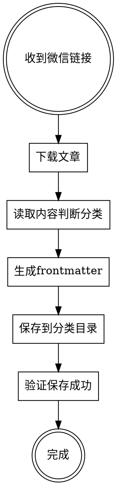

# 微信公众号文章自动保存

## Overview

自动下载微信公众号文章并保存到 Obsidian vault 的正确分类目录，包含标准 frontmatter 和本地图片。

## When to Use

- 用户提供微信公众号链接：`https://mp.weixin.qq.com/s/xxx`
- 用户请求保存、收藏、下载文章
- 用户说"用 opencli 保存这个"

## Workflow



## Step 1: Download Article

```bash
opencli weixin download --url "https://mp.weixin.qq.com/s/xxx" --output "/tmp/weixin-article"
```

Output creates directory with:
- `文章标题.md` - Markdown content
- `images/` - Downloaded images

## Step 2: Classify Article

Read article content (first 100 lines) to determine category:

| 内容关键词 | category | 存放目录 |
|-----------|----------|---------|
| AI、Claude Code、OpenClaw、Skills、Agent | `AI与编程` | `08-知识收藏/01-AI与编程/` |
| GitHub、API、爬虫、开发工具 | `开发工具与项目` | `08-知识收藏/02-开发工具与项目/` |
| OpenClaw 相关 | `OpenClaw生态` | `08-知识收藏/03-OpenClaw生态/` |
| 技术趋势、架构方案 | `技术方案与趋势` | `08-知识收藏/04-技术方案与趋势/` |
| 运营、自媒体、增长 | `产品运营与自媒体` | `08-知识收藏/05-产品运营与自媒体/` |
| 股票、量化、金融、投资 | `投资与金融` | `08-知识收藏/06-投资与金融/` |
| 亲子、研学、生活 | `生活与亲子` | `08-知识收藏/07-生活与亲子/` |
| 历史、人文 | `历史人文` | `08-知识收藏/08-历史人文/` |
| 教育、学校 | `教育资讯` | `08-知识收藏/09-教育资讯/` |

## Step 3: Generate Frontmatter

```yaml
---
title: 文章标题
date: 当前日期 (YYYY-MM-DD)
category: 根据内容判断
source: 微信公众号
author: 公众号名称
url: 原文链接
tags: [相关标签]
---
```

**Tags 规范：**
- 使用文章中的关键词
- 格式：`[关键词1, 关键词2, 关键词3]`
- 最多 3-5 个标签

## Step 4: Save to Vault

1. Create directory: `08-知识收藏/{分类}/文章标题/`
2. Copy images to: `08-知识收藏/{分类}/文章标题/images/`
3. Write markdown with frontmatter

**Image path format:** ``

## Step 5: Verify

- Check file exists
- Check images directory has all images
- Report wikilink: `[[08-知识收藏/{分类}/文章标题/文章标题.md]]`

## Quick Reference

| 命令 | 用途 |
|------|------|
| `opencli weixin download --url URL --output DIR` | 下载文章 |
| `opencli list \| grep weixin` | 查看微信相关命令 |

## Common Mistakes

| 问题 | 解决方案 |
|------|---------|
| 权限错误 EACCES | 运行 `sudo chown -R $(whoami) ~/.opencli` |
| 图片路径错误 | 使用相对路径 `images/img_xxx.jpeg` |
| 分类不确定 | 优先放 `01-AI与编程`，询问用户确认 |
| opencli 未安装 | `npm i -g @jackwener/opencli` |

## Example Output

```
✅ 文章已保存成功！

保存位置：[[08-知识收藏/01-AI与编程/浏览器自动化：从GUI到OpenCLI/浏览器自动化：从GUI到OpenCLI.md]]

**保存内容：**
- 📄 Markdown 文件（带标准 frontmatter）
- 🖼️ 12 张配图

**Frontmatter 信息：**
title: 浏览器自动化：从GUI到OpenCLI
date: 2026-04-17
category: AI与编程
source: 微信公众号
author: 阿里云开发者
tags: [OpenCLI, 浏览器自动化, Agent, API]
```