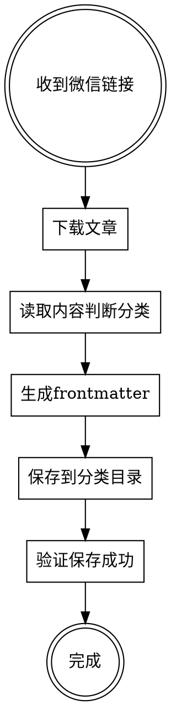

# 微信公众号文章自动保存

## Overview

自动下载微信公众号文章并保存到 Obsidian vault 的正确分类目录，包含标准 frontmatter 和本地图片。

## When to Use

- 用户提供微信公众号链接：`https://mp.weixin.qq.com/s/xxx`
- 用户请求保存、收藏、下载文章
- 用户说"用 opencli 保存这个"

## Workflow



## Step 1: Download Article

首选 opencli：

```bash
opencli weixin download --url "https://mp.weixin.qq.com/s/xxx" --output "/tmp/weixin-article"
```

Output creates directory with:
- `文章标题.md` - Markdown content
- `images/` - Downloaded images

### ⚠️ opencli 失败时的兜底（2026-09-22 实测，curl 通道）

`opencli weixin download` 依赖已登录的浏览器扩展，**经常整条命令挂掉**，典型报错：

```
ok: false
error:
  code: COMMAND_EXEC
  message: 'Pre-navigation to https://mp.weixin.qq.com failed: Navigation rejected.'
  help: Check that the site is reachable and the browser extension is running.
```

（启动时还常见 `EEXIST` 软链接警告 `~/.opencli/node_modules/@jackwener/opencli`，这个不影响，可忽略。）
判据是 `ok: false` + `Navigation rejected` —— 别再重试，直接走下面的 curl 通道，**无需登录态**。

```bash
cd /tmp/weixin-article
curl -sL -A "Mozilla/5.0 (Macintosh; Intel Mac OS X 10_15_7) AppleWebKit/605.1.15 (KHTML, like Gecko) Version/17.0 Safari/605.1.15" \
  "https://mp.weixin.qq.com/s/xxx" -o article.html -w "http_code=%{http_code} size=%{size_download}\n"
```

- 正常返回 `http_code=200`，`size` 通常 1–4 MB，正文在 `id="js_content"` 里。
- 正文范围：从 `id="js_content"` 到 `rich_media_area_extra`，先切出来再解析，避免混入推荐位。
- 抽取图片（按原文顺序）：`re.finditer(r'data-src="(https?://mmbiz[^"]+)"', body)`，
  图片一律在 `data-src` 而非 `src`；URL 里 `&amp;` 记得 `html.unescape`，并 `split('#')[0]` 去掉 `#imgIndex=` 锚点。

#### 拿"原图"而不是 640 缩略图

把 URL 的尺寸段换掉即可：

```
https://mmbiz.qpic.cn/.../640?wx_fmt=jpeg   →   https://mmbiz.qpic.cn/.../0?wx_fmt=jpeg
```

实测 `/0` 得到 1280–2861px 原图（`/640` 只有 640px）。下载时带上 Referer：

```bash
curl -sL -A "<同上 UA>" -e "https://mp.weixin.qq.com/" -o "01.jpg" "<把 /640? 换成 /0? 的 URL>"
```

⚠️ 文末那两张 27×25 / 299×38 的 png 是**公众号卡片图标或分隔符**，不是正文配图，别当内容图收。
用 `sips -g pixelWidth -g pixelHeight *.jpg` 过一遍尺寸即可区分。

#### 图片命名

按 `序号-城市或关键要素.jpg` 命名（如 `08-镇江-何处望神州.jpg`），比 `img_1.jpg` 好检索得多。

---

## Step 1b: 非微信来源（地方媒体 SPA）取原图

对标稿、苏超这类题材的配图常常只在**地方媒体/自媒体站**上，那些站多是 SPA，静态抓不到图。
2026-09-22 在扬州新闻网（`share.96189.com`）跑通了一条通用路线，按顺序试：

### 1. 先试静态，不行立刻换浏览器

```bash
curl -sL -A "<Safari UA>" "<url>" -o page.html -w "http=%{http_code} size=%{size_download}\n"
```

SPA 的 HTML 只有壳（正文为空、`` 全是 base64 占位、`data-src` 被懒加载替换）。
判据：文件里搜不到正文文字、也搜不到任何 `http...jpg`。

### 2. 用 ego-browser 打开（沙箱内必须走 launchctl）

```bash
launchctl asuser 501 /Users/zhugx/.local/bin/ego-browser nodejs > /tmp/out.txt 2>&1 <<'EOF'
await useOrCreateTaskSpace('任务名_日期')      // ⚠️ 每次脚本第一行都要写
await openOrReuseTab('<url>', { wait: true, timeout: 45 })
cliLog(JSON.stringify(await pageInfo()))      // 短链会自动跳到真实文章页
EOF
```

Bash 需 `dangerouslyDisableSandbox=true`；`>` 在 `2>&1` **之前**（见 ego-browser-workbuddy 技能）。

### 3. 最优解：找站点 JSON 接口，别抠 DOM

在 `js()` 里读 `document.querySelectorAll('img')` 拿到的多半还是懒加载占位。
**真正的办法是逆向接口**：

1. 页面里 `<script src=/yfs/Article/js/app.<hash>.js>` → 下载它；
2. 搜 `r.src=p.p+"js/"`，取出 webpack chunk 名与 hash 映射，拼出
   `<p.p>/js/<chunk>.<hash>.js` 再下载；
3. 在该 chunk 里搜 `interbaseUrl` 得到 API 主机，搜 `externalService?service=` 得到接口路径；
4. 在页面内同源 fetch（绕过 CORS），**大响应必须 `fs.writeFileSync` 落盘**，
   不能只 `cliLog`（会被截断）：

```js
const out = await js(String.raw`(async () => {
  const body = 'params=' + encodeURIComponent(JSON.stringify({articleId: AID, detailFlag: 1})) + '&apiVersion=2.9';
  const r = await fetch('https://<api主机>/setsail/external/externalService?service=getArticleDetail',
    { method:'POST', headers:{'Content-Type':'application/x-www-form-urlencoded; charset=UTF-8'}, body });
  return await r.text();
})()`)
const fs = await import('node:fs')            // ⚠️ 必须 import()，不能 require()
fs.writeFileSync('/tmp/detail.json', String(out))
```

> 96189 实测：`detailFlag: 0` 只返回 meta（title/createDate/author/thumb），
> **`detailFlag: 1` 才有 `data.content`**（含 ``）。`articleId` 就是短链跳转后 URL 末段。

### 4. 下载原图会撞上限 → 用站点自带的图片处理服务

裸链下载被**精确截断在 5 MB / 2 MB**（文件大小是整 5242880 / 2097152 字节）。
下载前先看一眼大小是否恰好卡在整数 MB。

改用站点自己的 resize 参数（从 `thumb` 字段就能看出格式）：

```
http://<host>/butelvod/<id>.jpg?cmd=imageprocess/format/jpg/processtype/2/width/1800/quality/90
```

1800 宽实测 271 KB / 198 KB，完整可用。

### 5. 完整性校验（别只看 `sips` 能读尺寸）

```python
d = open(f,'rb').read()
print(len(d), "EOI_OK" if d[-2:] == b'\xff\xd9' else "TRUNCATED")
```

`sips` 能读尺寸只说明文件头没坏，**不代表文件完整**。

### 6. 视觉确认 + 裁剪

用 `Read` 看图确认画面内容（本次踩坑：竖版那张是「巨型战袍」，横版夜景才是李白布），
再用 PIL 裁到主体后归档：

```python
from PIL import Image
Image.open('src.jpg').crop((300, 350, 1600, 1050)).save('out.jpg', quality=92)
```

### 7. 收尾：关闭自己的 task space

```js
await completeTaskSpace('<任务名>', { keep: false })
```

返回 `{"done":true}` 但列表里 `ownership` 变成 **user** ＝ 用户接管了该窗口，
**不得再对它做任何操作**。他人（其他 session）创建的空间**不要擅自关闭**，列出来问用户。

---

## Step 1c: 读者供图/视频截图的缺陷处理（PIL）

读者常常直接发来**视频截图**，图上带播放器浮层（播放键、进度条、白色圆角块）。这类图不能直接进正文。
2026-09-22 在苏超 Tifo 稿上跑通的处理顺序：

### 1. 先定位浮层——别靠肉眼估坐标

肉眼估坐标极易错（我估错过一次，裁到了无关区域）。两种可靠做法：

1. **画坐标网格再读**：把 10%/20% 网格线画到图上，缩到固定宽度后 `Read`，按网格读坐标。
2. **颜色阈值检测**（浮层多为纯白或低饱和）：`mx>=225 且 (mx-mn)<=18` 得到纯白实心区，取 bbox。
   ⚠️ 阈值放宽会误命中画面本身的浅色区域（云纹、屋顶钢架），**检测框必须限定在已知区域内**。

### 2. 先裁掉播放器边框

视频截图通常带白色圆角边。按「白色占比 < 60%」求内容区 bbox 再裁：

```python
white = (mx>=205) & ((mx-mn)<=30)
cs = [i for i,v in enumerate(white.mean(0)) if v<0.6]
rs = [i for i,v in enumerate(white.mean(1)) if v<0.6]
im.crop((cs[0]+2, rs[0]+2, cs[-1]-2, rs[-1]-2))
```

### 3. 填补浮层：**羽化 + 邻近同质纹理**，不要镜像硬贴

- ❌ **镜像硬贴**（取左侧等宽条翻转填补）：出来是一个**硬边矩形块**，比原浮层还难看。实测否决。
- ✅ **从邻近同质区域取样 + 高斯羽化蒙版**：

```python
from PIL import Image, ImageFilter
src = im.crop((x0, y0+dy, x1, y1+dy))        # 从下方(或侧向)取同质纹理
mm = Image.new('L', (x1-x0, y1-y0), 0)
mm.paste(255, (5,5,x1-x0-5,y1-y0-5))
mm = mm.filter(ImageFilter.GaussianBlur(8))   # 羽化 8~10px
im.paste(src, (x0, y0), mm)
```

### 4. 验收标准：**按正文实际显示宽度评估，不要按 100% 原图**

公众号正文图最大显示宽 **677px**。原图 1871 宽 → 缩放 0.36，
90px 的播放键在读者眼里只有 **33px**。做法：

```python
im.resize((677, int(677*im.height/im.width)), Image.LANCZOS).save('preview.jpg')
```

- 在 677px 下**看不出痕迹**即可用；放大到 100% 一定会有淡痕，**这是可接受的**。
- 但仍要**如实告知用户**放大可见修补痕，并给出「换一张干净截图」的备选。

### 5. 命名与留档

- 处理后的图 → `assets/<主题>-<序号>-<城市>-<名称>.jpg`
- **原始截图另存一份**到素材/对标目录（文件名标明「原始截图含播放键」），便于回溯与替换。


## Step 2: Classify Article

Read article content (first 100 lines) to determine category:

| 内容关键词 | category | 存放目录 |
|-----------|----------|---------|
| AI、Claude Code、OpenClaw、Skills、Agent | `AI与编程` | `08-知识收藏/01-AI与编程/` |
| GitHub、API、爬虫、开发工具 | `开发工具与项目` | `08-知识收藏/02-开发工具与项目/` |
| OpenClaw 相关 | `OpenClaw生态` | `08-知识收藏/03-OpenClaw生态/` |
| 技术趋势、架构方案 | `技术方案与趋势` | `08-知识收藏/04-技术方案与趋势/` |
| 运营、自媒体、增长 | `产品运营与自媒体` | `08-知识收藏/05-产品运营与自媒体/` |
| 股票、量化、金融、投资 | `投资与金融` | `08-知识收藏/06-投资与金融/` |
| 亲子、研学、生活 | `生活与亲子` | `08-知识收藏/07-生活与亲子/` |
| 历史、人文 | `历史人文` | `08-知识收藏/08-历史人文/` |
| 教育、学校 | `教育资讯` | `08-知识收藏/09-教育资讯/` |

## Step 3: Generate Frontmatter

```yaml
---
title: 文章标题
date: 当前日期 (YYYY-MM-DD)
category: 根据内容判断
source: 微信公众号
author: 公众号名称
url: 原文链接
tags: [相关标签]
---
```

**Tags 规范：**
- 使用文章中的关键词
- 格式：`[关键词1, 关键词2, 关键词3]`
- 最多 3-5 个标签

## Step 4: Save to Vault

1. Create directory: `08-知识收藏/{分类}/文章标题/`
2. Copy images to: `08-知识收藏/{分类}/文章标题/images/`
3. Write markdown with frontmatter

**Image path format:** ``

## Step 5: Verify

- Check file exists
- Check images directory has all images
- Report wikilink: `[[08-知识收藏/{分类}/文章标题/文章标题.md]]`

## Quick Reference

| 命令 | 用途 |
|------|------|
| `opencli weixin download --url URL --output DIR` | 下载文章 |
| `opencli list \| grep weixin` | 查看微信相关命令 |

## Common Mistakes

| 问题 | 解决方案 |
|------|---------|
| 权限错误 EACCES | 运行 `sudo chown -R $(whoami) ~/.opencli` |
| `download` 报 `Navigation rejected` / `ok: false` | opencli 浏览器通道挂了，改用 Step 1 的 **curl 兜底通道**，勿重复重试 |
| 图片只有 640px | URL 的 `/640?` 换成 `/0?` 取原图 |
| **图片路径告警缺失，但"看着文件名一样"** | **你/您、已/己、土/士 这类同音异形字**极易混——**逐字节比对**（`f.encode('utf-8')` 或 `unicodedata.normalize('NFC', …)`）。根因通常是**命名素材时沿用了对标原文的用字**，而正文用了权威来源的写法。**命名素材一律以最终正文用字为准**，别抄对标稿 |
| 图片路径错误 | 使用相对路径 `images/img_xxx.jpeg` |
| 分类不确定 | 优先放 `01-AI与编程`，询问用户确认 |
| opencli 未安装 | `npm i -g @jackwener/opencli` |

## Example Output

```
✅ 文章已保存成功！

保存位置：[[08-知识收藏/01-AI与编程/浏览器自动化：从GUI到OpenCLI/浏览器自动化：从GUI到OpenCLI.md]]

**保存内容：**
- 📄 Markdown 文件（带标准 frontmatter）
- 🖼️ 12 张配图

**Frontmatter 信息：**
title: 浏览器自动化：从GUI到OpenCLI
date: 2026-04-17
category: AI与编程
source: 微信公众号
author: 阿里云开发者
tags: [OpenCLI, 浏览器自动化, Agent, API]
```