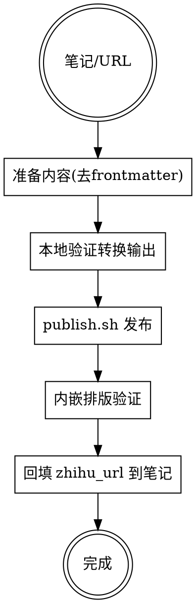

# 知乎文章发布

## Overview

将 vault 内的 Markdown 笔记发布为知乎专栏文章，自动处理格式转换（Markdown → 知乎富文本）、发布和验证。

## 前置条件

- 工具目录：`/Users/zhugx/codeup/obsidian/tools/zhihu-automation-skill/`（已配置，含 `.env` 密钥）
- 知乎登录态：Cookie 保存在 `~/.hermes/credentials/zhihu-cookies.enc`，约 30 天有效
  - 过期后：`node scripts/zhihu-export-cookie.js` 打开 Edge 扫码重新登录
- 浏览器：使用用户已登录的 **Edge**（channel: msedge，已设为默认）

## Workflow



### 步骤 1：准备内容

1. 读取笔记，提取 frontmatter 中的 `title` 作为文章标题
2. 去掉 YAML frontmatter，正文存为独立 `.md` 文件（放 `/Users/zhugx/codeup/obsidian/tools/zhihu-automation-skill/` 下）
3. 正文首行不要重复标题（知乎编辑器标题单独填）

### 步骤 2：本地验证转换（可选但推荐）

```bash
cd /Users/zhugx/codeup/obsidian/tools/zhihu-automation-skill
node -e "
import('./scripts/zhihu-browser.js').then(m => {
  const { readFileSync } = require('fs');
  const md = readFileSync('文章.md', 'utf-8');
  console.log(m.mdToZhihuHTML(md).slice(0, 500));
});"
```

检查输出：`<h2>`、`<ul><li>`、`<pre><code>`、`<blockquote>` 结构正确。

### 步骤 3：发布

```bash
cd /Users/zhugx/codeup/obsidian/tools/zhihu-automation-skill
./publish.sh article --title "文章标题" --content-file 文章.md
```

- 密钥从 `.env` 自动加载，无需手动 export
- 浏览器默认 Edge，无需 `--channel` 参数
- 脚本内置排版验证：粘贴后检查正文无 Markdown 残留（`##`/`**`/```` ``` ````），失败自动中止

### 步骤 4：验证与回填

1. 发布输出会返回文章 URL（形如 `https://zhuanlan.zhihu.com/p/数字`）
2. 将 URL 回填到笔记 frontmatter 的 `zhihu_url` 字段
3. git 提交

## 关键技术知识（踩坑记录）

| 知识点 | 说明 |
|--------|------|
| 知乎编辑器是 **Draft.js** | `public-DraftEditor-content`，非 ProseMirror |
| 必须用 `text/html` 粘贴 | 纯文本（text/plain）不会被解析 Markdown，`##`、`**` 原样显示 |
| 表格不支持 | 知乎编辑器无 `<table>`，`mdToZhihuHTML` 自动降级为列表 |
| 粘贴需绑定正确节点 | 页面上有多个 contenteditable（标题框/正文框），必须用 findElement 找到的节点 dispatch paste，不能用 `querySelector('[contenteditable]')` 取第一个 |
| 发布后 URL 带 `/edit` 后缀 = 发布失败 | 内容存成草稿停在编辑态，需要重新发布 |
| 删除已发布文章 | `node scripts/zhihu-delete.js --article <id>`（创作中心更多→删除） |
| 草稿删除 | 手动：打开 `https://zhuanlan.zhihu.com/p/<id>/edit` → 更多 → 删除 |

## 常见问题

- **发布返回 `/edit` URL**：发布按钮没点成功，内容成了草稿 → 重新发布
- **排版验证中止**：粘贴退化为纯文本 → 检查是否用了 contentEl.evaluate 绑定正确节点
- **Cookie 过期**：`node scripts/zhihu-export-cookie.js` 重新扫码（会打开 Edge 窗口）
- **脚本进程残留**：Cookie 持久化失败时 node 进程可能挂起，用 `ps aux | grep zhihu-` 检查并清理
